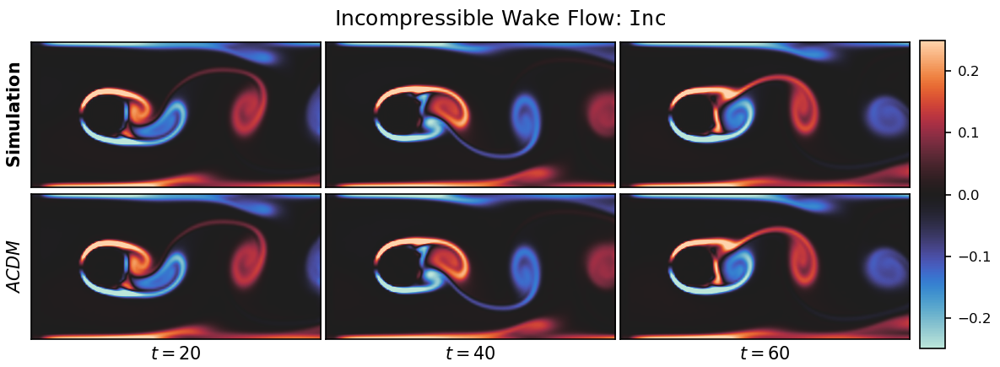
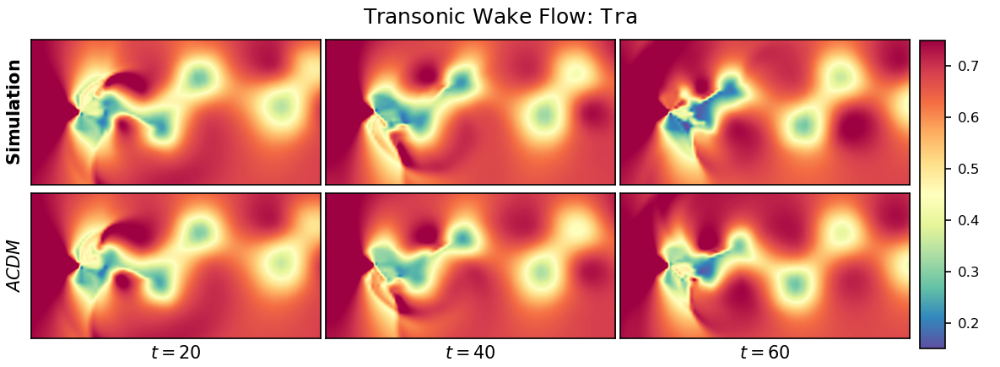
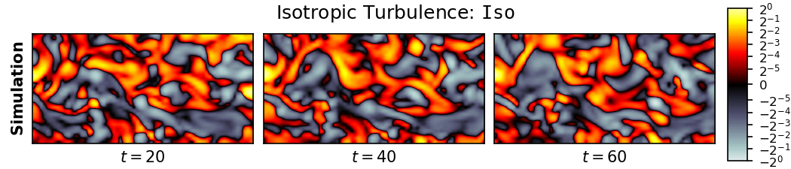

# Benchmarking Autoregressive Conditional Diffusion Models for Turbulent Flow Simulation
This repository contains the source code for the paper [Benchmarking Autoregressive Conditional Diffusion Models for Turbulent Flow Simulation](https://arxiv.org/abs/2309.01745) by [Georg Kohl](https://ge.in.tum.de/about/georg-kohl/), [Liwei Chen](https://ge.in.tum.de/about/dr-liwei-chen/), and [Nils Thuerey](https://ge.in.tum.de/about/n-thuerey/). Our work benchmarks the prediction of turbulent flow fields from an initial condition across a range of architectures:

1. **Autoregressive conditional diffusion models (ACDMs):** This method relies on the DDPM approach, a class of generative models based on a parameterized Markov chain. They can be trained to learn the conditional distribution of a target variable given a conditioning. In our case, the target variable is the flow field at the next time step, and the conditioning is the flow field at the current time step, i.e., the simulation trajectory is created via autoregressive unrolling of the model. We showed that ACDMs can accurately and probabilistically predict turbulent flow fields, and that the resulting trajectories align with the statistics of the underlying physics. Furthermore, ACDMs can generalize to flow parameters beyond the training regime, and exhibit high temporal rollout stability, without compromising the quality of generated samples.

2. **U-Net Variants**: We consider a range of different training variants of the backbone U-Net used in ACDM. It can be trained as a classic next-step predictor, with unrolled training to improve the stability, or with additional training noise. Furthermore, we also implement [PDE-Refiner](https://arxiv.org/abs/2308.05732) based on this U-Net.

3. **ResNets and Fourier Neural Operators**: Our source code also integrates [Dilated ResNets](https://arxiv.org/abs/2112.15275) and [Fourier Neural Operators](https://github.com/NeuralOperator/neuraloperator), as established flow prediction architectures.

4. **Latent-Space Transformers**: Finally, we provide different implementation variants of latent-space transformers. These architectures contain an autoencoder to embed the flow states in a smaller latent space. A secondary transformer model computes updated latent spaces forward in time, that can be decoded to create flow trajectories. We train the combined architecture end-to-end.


All architectures are evaluated on three carefully designed data sets of varying difficulty:

1. **Incompressible Wake Flow (*Inc*):** This relatively simple data set contains 91 incompressible wake flow trajectories simulated with PhiFlow at Reynolds numbers 100-1000. Each sequence contains 1300 temporal snapshots of pressure and velocity.

https://ge.in.tum.de/download/autoreg-pde-diffusion/video_data/predictions_full_inc_var_vort.mp4

2. **Transonic Cylinder Flow (*Tra*):** This data set contains 41 sequences of a two-dimensional transonic cylinder flow simulated with the fluid solver SU2. Each sequence has a different Mach number between 0.5 and 0.9 at Reynolds number 10000, making the flows in the transonic regime highly chaotic. All trajcetories feature 1000 temporal snapshots of pressure, density, and velocity.

https://ge.in.tum.de/download/autoreg-pde-diffusion/video_data/predictions_full_tra_long_pres.mp4

3. **Isotropic Turbulence (*Iso*):** This highly complex, underdetermined data set consists of 1000 two-dimensional sequences sliced from three-dimensional, isotropic turbulence simulations. The flows were computed with DNS and the raw data is provided by the Johns Hopkins Turbulence Database. Each sequence contains 1000 temporal snapshots of pressure and velocity, including the velocity z-component.

https://ge.in.tum.de/download/autoreg-pde-diffusion/video_data/predictions_full_iso_vort.mp4


Further information about this work can be also found at our [project website](https://ge.in.tum.de/publications/2023-acdm-kohl/). Feel free to contact us if you have questions or suggestions regarding our work or the source code provided here.

-----------------------------------------------------------------------------------------------------

## Simple ACDM Demonstration

[](https://colab.research.google.com/github/tum-pbs/autoreg-pde-diffusion/blob/master/acdm-demo.ipynb)

Using the button above, you can run a simple example notebook in Google Colab that demonstrates ACDM (a Google account is required). Instead, it is also possible to locally run the provided `acdm-demo.ipynb` file, by following the [installation instructions](#installation) in the next section and [running the notebook](https://docs.jupyter.org/en/latest/running.html) inside the created conda environment afterwards.


## Installation
In the following, Linux is assumed as the OS but the installation on Windows should be similar.

We recommend to install the required python packages (see `requirements.yml`) via a conda environment (e.g. using [miniconda](https://docs.conda.io/en/latest/miniconda.html)), but it may be possible to install them with *pip* (e.g. via *venv* for a separate environment) as well.
```shell
conda env create -f requirements.yml
conda activate ACDM
```
In the following, all commands should be run from the root directory of this source code. Running the training or sampling code in the `src` directory requires the generation of data sets as described in the following.


## Model Training, Sampling, and Evaluation
Once the data sets are generated, model architectures can be trained using the scripts `src/training_*.py`, trained models can be sampled with `src/sample_models_*.py`, and model predictions can be evaluated and visualized with `src/plot_*.py`. Each script contains various configuration options and architecture selections at the beginning of the file. All files should be run according to the following pattern:
```shell
python src/training_*.py
python src/sample_models_*.py
python src/plot_*.py
```

## Directory Structure
The directory `src/turbpred` contains the general code base that the training and sampling scripts rely on. The `src/lsim` directory contains the [LSiM metric](https://github.com/tum-pbs/LSIM) that is used for evaluations. The `data` directory contains data generation scripts, and downloaded or generated data sets should end up there as well. The `runs` directory contains the trained models which are loaded by the sampling scripts, as well as further checkpoints and log files. The `results` directory contains the results from the sampling, evaluation, and plotting scripts. Sampled model predictions are written to this directory as compressed numpy arrays, that are read by the plotting scripts, which in turn write the resulting plots to the same directory.


## Training Monitoring with Tensorboard
During training, various values, statistics and plots are logged to Tensorboard, allowing for monitoring the training progress. To start Tensorboard, use the following command:
```shell
tensorboard --logdir=runs --port=6006
```
and open http://localhost:6006/ in your browser to inspect the logged data.


-----------------------------------------------------------------------------------------------------

## Data Generation, Download, and Processing

### Downloading our Data

Our simulated data sets will be available to download soon! Thus, all data sets have to be generated locally for now as described below.

### Generation with PhiFlow: Incompressible Wake Flow (*Inc*)


To generate data with the fluid solver PhiFlow, perform the following steps:
1. Download the [PhiFlow source code](https://github.com/tum-pbs/PhiFlow) and follow the [installation instructions](https://tum-pbs.github.io/PhiFlow/Installation_Instructions.html). We use the PyTorch backend, that should work out of the box with a correction installation of PhiFlow. **Our scripts assume the usage of version 2.0.3 at commit [abc82af2](https://github.com/tum-pbs/PhiFlow/tree/abc82af247a4f9de49a0d246277a421739eed7c1)! Substantially newer versions might not work.**
2. Ensure that the packages *numpy*, *matplotlib*, and *imageio* are installed in the python environment used for PhiFlow.
3. Add our data generation scripts that handle the solver setup and data export to the PhiFlow installation by copying all files from the `data/generation_scripts/PhiFlow` directory to the `demos` directory in your PhiFlow directory.
4. The copied files contain the PhiFlow scene for the *Inc* training and test data set (.py files), that can be run in the same way as the other example PhiFlow scene files in the `demos` directory. The corresponding batch generation scripts (.sh files) simply run the scene multiple times with different parameters to build the full data set.
5. Adjust paths and settings in the python generation file if necessary, and run it or alternatively the batch script to generate the data.
6. Copy or move the generated data set directory to the `data` directory of this source code for training. Make sure to follow the data set structure described below.


### Generation with SU2: Transonic Cylinder Flow (*Tra*)


To generate data with the fluid solver SU2, perform the following steps:
1. Follow the general [SU2 installation instructions](https://su2code.github.io/docs_v7/SU2-Linux-MacOS/) with the Python Modules. **We ran the generation on SU2 version 7.3.1 (Blackbird)! Substantially newer versions might not work.** Make sure that you have access to an MPI implementation on your system as well, since our generation script runs SU2 via the `mpiexec` command. Try running the provided [SU2 test cases](https://su2code.github.io/docs_v7/Test-Cases/) to ensure the installation was successful.
2. Ensure that the packages *numpy*, *matplotlib*, and *scipy* are installed in the python environment used for SU2.
3. Add our data generation scripts that handle the solver setup and data export to the SU2 installation by copying all files from the `data/generation_scripts/SU2` directory to a new directory in the root of your SU2 installation (for example called `SU2_raw`). These include the main generation script `data_generation.py`, the python helper file `convert_data.py` to convert the data to compressed numpy arrays, as well as the mesh file `grid_quad_2d.su2` for all simulations. Furthermore, the SU2 configuration files for the three consecutive simulations (1. steady simulation as initialization: `steady.cfg`, 2. unsteady warmup: `unsteady_2d_initial.cfg`, 3. actual simulation for data generation: `unsteady_2d_lowDissipation.cfg`) run by the python script are included.
4. Adjust paths and settings in the python generation file if necessary, and run it with the following command to generate the data (from the root directory of the SU2 installation):
```shell
python SU2_raw/data_generation.py [Thread count] [Reynolds number] [List of Mach numbers] [List of corresponding simulation folder IDs] [Restart iteration]
```
For example, to create three simulations at Mach numbers 0.6, 0.7, and 0.8 with Reynolds number 10000 using 112 threads, run the following command:
```shell
python SU2_raw/data_generation.py 112 10000 0.60,0.70,0.80 0,1,2 -1
```
5. Copy or move the generated data set directory to the `data` directory of this source code for training.
6. Post-process the data set directory structure with the `src/convert_SU2_structure.py` script (adjust script settings if necessary), that also extracts some information from the auxiliary simulation files. Make sure that the converted data directory follows the data set structure described below.


### Download from the Johns Hopkins Turbulence Database: Isotropic Turbulence (*Iso*)


To extract sequences from the [Johns Hopkins Turbulence Database](http://turbulence.pha.jhu.edu/), the required steps are:
1. Install the [pyJHTDB package](https://github.com/idies/pyJHTDB) for local usage, and make sure *numpy* is available.
2. Request an [authorization token](http://turbulence.pha.jhu.edu/authtoken.aspx) to ensure access to the full data base, and add it to the script `data/generation_scripts/JHTDB/get_JHTDB.py`
3. Adjust the paths and settings in the script file if necessary, and run the script to download and convert the corresponding regions of the DNS data. The script `data/generation_scripts/JHTDB/get_JHTDB_scheduler.py` can be run instead as well. It reconnects to the data base automatically in case the connection is unstable or is otherwise interrupted, and resumes the download.
4. Copy or move the downloaded data set directory to the `data` directory of this source code for training if necessary. Make sure to follow the data set structure described below.


### Data Set Structure
Ensure that the data set folder structure resulting from the data generation is the following to ensure the data set can be loaded correctly: `data/[datasetName]/sim_[simNr]/[field]_[timestep].npz`. Here datasetName is any string, but has to be adjusted accordingly when creating data set objects. The simulation folder numbers should be integers with a fixed width of six digits and increae continuously. Similarly, the timestep numbering should consist of integers with a fixed width of six digits and increase continuously. Start and end points for both can be configured when creating Dataset objects. Fields should be strings that describe the physical quantity, such as pressure, density, or velocity. Velocity components are typically stored in a single array, apart from the *Iso* case where the velocity z-component is stored separately as velocityZ. For example, a density snapshot at timestep zero from the *Tra* data set is referenced as `data/128_tra/sim_000000/density_000000.npz`.


### General Data Post-Processing
`src/copy_data_lowres.py` can be used to downsample the generation resolution of `256x128` to the training and evaluation resolution of `128x64` for the simulated data sets. It processes all .npz data files, while creating copies of all supplementary files in the input directory. Computing mean and standard deviation statistics for the data normalization to a standard normal distribution is performed via `src/compute_data_mean_std.py`.


-----------------------------------------------------------------------------------------------------

## Citation
If you use the source code or data sets provided here, please consider citing our work:
```
@article{kohl2023_acdm,
  author = {Georg Kohl and Li{-}Wei Chen and Nils Thuerey},
  title = {Benchmarking Autoregressive Conditional Diffusion Models for Turbulent Flow Simulation},
  journal = {arXiv},
  year = {2023},
  eprint = {2309.01745},
  primaryclass = {cs},
  publisher = {arXiv},
  url = {https://doi.org/10.48550/arXiv.2309.01745},
  doi = {10.48550/arXiv.2309.01745},
  archiveprefix = {arxiv}
}
```

## Acknowledgements
This work was supported by the ERC Consolidator Grant *SpaTe* (CoG-2019-863850).

