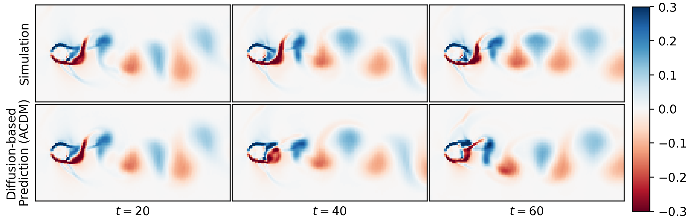

# Turbulent Flow Simulation using Autoregressive Conditional Diffusion Models (ACDM)
This repository will contain the source code for the paper [Turbulent Flow Simulation using Autoregressive Conditional Diffusion Models](https://arxiv.org/abs/2309.01745) by [Georg Kohl](https://ge.in.tum.de/about/georg-kohl/), [Liwei Chen](https://ge.in.tum.de/about/dr-liwei-chen/), and [Nils Thuerey](https://ge.in.tum.de/about/n-thuerey/).

## Abstract
Simulating turbulent flows is crucial for a wide range of applications, and machine learning-based solvers are gaining increasing relevance. However, achieving stability when generalizing to longer rollout horizons remains a persistent challenge for learned PDE solvers. We address this challenge by introducing a fully data-driven fluid solver that utilizes an autoregressive rollout based on conditional diffusion models. We show that this approach offers clear advantages in terms of rollout stability compared to other learned baselines. Remarkably, these improvements in stability are achieved without compromising the quality of generated samples, and our model successfully generalizes to flow parameters beyond the training regime. Additionally, the probabilistic nature of the diffusion approach allows for inferring predictions that align with the statistics of the underlying physics. We quantitatively and qualitatively evaluate the performance of our method on a range of challenging scenarios, including incompressible and transonic flows, as well as isotropic turbulence.

## Source Code
The source code and our data sets will be available soon! Further information can be found at our [project website](https://ge.in.tum.de/publications/2023-acdm-kohl/).
